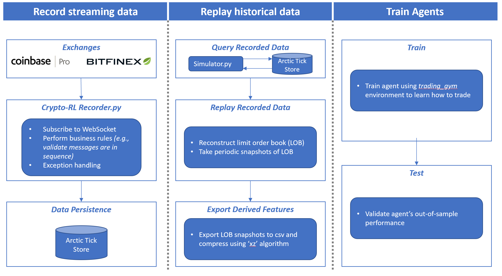
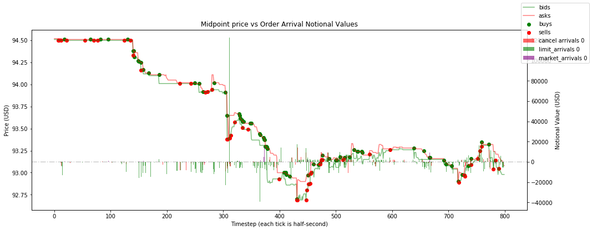

# Deep Reinforcement Learning Toolkit for Cryptocurrencies


**Table of contents:**

1. Purpose
2. Scope
3. Dependencies
4. Project structure
5. Design patterns
6. Getting started
7. Citing this project
8. Appendix 

## 1. Purpose
The purpose of this application is to provide a toolkit to:
 - **Record** full limit order book and trade tick data from two 
 exchanges (**Coinbase Pro** and **Bitfinex**) into an [Arctic](https://github.com/manahl/arctic) 
 Tickstore database (i.e., MongoDB), 
 - **Replay** recorded historical data to derive feature sets for training
 - **Train** an agent to trade cryptocurrencies using the DQN algorithm (note: this agent
  implementation is intended to be an example for users to reference)




## 2. Scope
Research only; there is no capability for live-trading at exchanges.


## 3. Dependencies
See `requirements.txt`

*Note*: to run and train the DQN Agent (`./agent/dqn.py`) tensorflow and Keras-RL
need to be installed manually and are not listed in the `requirements.txt` 
in order to keep this project compatible with other open 
sourced reinforcement learning platforms 
(e.g., [OpenAI Baselines](https://github.com/openai/baselines)).

Pip install the following:

```
Keras==2.2.4
Keras-Applications==1.0.7
Keras-Preprocessing==1.0.9
keras-rl==0.4.2

tensorboard==1.13.1
tensorflow-estimator==1.13.0
tensorflow-gpu==1.13.1
```


## 4. Project Structure
The key elements in this project and brief descriptions.
```
crypto-rl/
	agent/
		...reinforcement learning algorithm implementations
	data_recorder/
		...tools to connect, download, and retrieve limit order book data
	gym_trading/
		...extended openai.gym environment to observe limit order book data
	indicators/
		...technical indicators implemented to be O(1) time complexity
	design-patterns/
		...visual diagrams module architecture
	venv/
		...virtual environment for local deployments
	experiment.py          # Entry point for running reinforcement learning experiments
	recorder.py            # Entry point to start recording limit order book data
	configurations.py      # Constants used throughout this project
	requirements.txt       # List of project dependencies
	setup.py               # Run the command `python3 setup.py install` to 
	                       #    install the extended gym environment i.e., gym_trading.py
```


## 5. Design Patterns
Refer to each individual module for design pattern specifications:

- [Limit Order Book, Data Recorder, and Database](./data_recorder/README.md)
- [Stationary LOB Features](https://arxiv.org/abs/1810.09965v1)
- [POMDP Environment](./gym_trading/README.md)
- [Learning Algorithms and Neural Networks](./agent/README.md)

Sample snapshot of Limit Order Book levels:


Sample snapshot of Order Arrival flow metrics:



## 6. Getting Started

Install the project on your machine:
```
# clone the project from github
git clone https://github.com/sadighian/crypto-rl.git
cd crypto-rl

# install a virtual environment for the project's dependencies
python3 -m venv ./venv

# turn on the virtual environment
source venv/bin/activate

# install keras-rl dependencies
pip3 install Keras==2.2.4 Keras-Applications==1.0.7 Keras-Preprocessing==1.0.9 keras-rl==0.4.2
 tensorboard==1.13.1 tensorflow-estimator==1.13.0 tensorflow-gpu==1.13.1

# install the project
pip3 install -e .
```

### 6.1 Record limit order book data from exchanges

**Step 1:**
Go to the `configurations.py` and define the crypto currencies which
you would like to subscribe and record. 

Note: basket list format is as follows `[(Coinbase_Instrument_Name, Bitfinex_Instrument_Name), ...]`
```
SNAPSHOT_RATE = 5  # I.e., every 5 seconds
BASKET = [('BTC-USD', 'tBTCUSD'),
         ('ETH-USD', 'tETHUSD'),
         ('LTC-USD', 'tLTCUSD'),
         ('BCH-USD', 'tBCHUSD'),
         ('ETC-USD', 'tETCUSD')]
RECORD_DATA = True
```

**Step 2:**
Open a CLI/terminal and execute the command to start recording 
full limit order book and trade data.
 ```
 python3 recorder.py
 ```

### 6.2 Replay recorded data to export stationary feature set

**Step 1:**
Ensure that you have data in your database. 

Check with MongoDB shell or [Compass](https://www.mongodb.com/products/compass). 
If you do not have data, see refer to the section above 
**5.1 Record limit order book data from exchanges**.

**Step 2:**
Run a historial data simulation to take snapshots of the
limit order book(s) and export their stationary features
to a compressed csv.

To do this, you can leverage the test cases in `data_recorder/tests/`
or write your own logic. When using the test case methods, make sure
to change the query parameters to match what you've actually recorded and
is in your database.

Example to export features to a compressed csv:
```
python3 data_recorder/tests/test_extract_features.py
```

### 6.3 Train an agent

**Step 1:**
Ensure you have data in the `data_recorder/database/data_exports/` folder.
This is where the agent loads data from. If you do not have data exported
into that folder, see refer to the section above 
**5.2 Replay recorded data to export stationary feature set**.

**Step 2:**
Open a CLI/terminal and start learning/training the agent. 
```
python3 experiment.py --window_size=50 --weights=False --fitting_file=...
```
Refer to `experiment.py` to see all the keyword arguments.


## 7. Citing this project

Please remember to cite this repository if used in your research:
```
    @misc{Crypto-RL,
        author = {Jonathan Sadighian},
        title = {Deep Reinforcement Learning Toolkit for Cryptocurrencies},
        year = {2019},
        publisher = {GitHub},
        journal = {GitHub repository},
        howpublished = {\url{https://github.com/sadighian/crypto-rl}},
    }
```


## 8. Appendix
### 8.1 Branches
There are multiple branches of this project, each with a different implementation pattern 
for persisting data:
 - **FULL** branch is intended to be the foundation for a fully automated trading system 
 (i.e., implementation of design patterns that are ideal for a trading system that requires 
 parallel processing) and persists streaming tick data into an **Arctic Tick Store**
 
 **Note:** the branches below (i.e., lightweight, order book snapshot, mongo integration) 
 are no longer actively maintained as of October 2018, and are here for reference.
 
 - **LIGHT WEIGHT** branch is intended to record streaming data more efficiently than 
 the __full__ branch (i.e., all websocket connections are made from a single process 
 __and__ the limit order book is not maintained) and persists streaming tick data into 
 an **Arctic tick store**
 - **ORDER BOOK SNAPSHOT** branch has the same design pattern as the __full__ branch, 
 but instead of recording streaming ticks, snapshots of the limit order book are taken 
 every **N** seconds and persisted into an **Arctic tick store**
 - **MONGO INTEGRATION** branch is the same implementation as **ORDER BOOK SNAPSHOT**, 
 with the difference being a standard MongoDB is used, rather than Arctic. 
 This branch was originally used to benchmark Arctic's performance and is not up to 
 date with the **FULL** branch.

### 8.2 Assumptions
- You have installed a virtual environment and installed the project to that venv 
(e.g., `pip3 install -e .`)
- You have mongoDB already installed
- You know how to use a cli to start python scripts
- You are running an ubuntu 18+ os

### 8.3 Change Log
- 2019-12-12: Added docstrings and refactored many classes to improve code readability
- 2019-09-18: Refactored `env`s and `broker`s for simplification and
  added different `reward` approaches.
- 2019-09-13: Created and implemented 'order arrival' flow metrics,
  inspired by
  [Multi-Level Order-Flow Imbalance in a Limit Order Book](https://arxiv.org/abs/1907.06230v1)
  by Xu, Ke; Gould, Martin D.; Howison, Sam D.
- 2019-09-06: Created and implemented `Indicator.py` base class
- 2019-04-28: Reorganized project structure for simplicity
