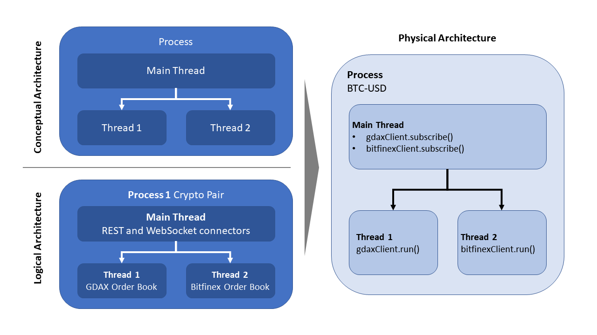

# Multiprocessing Crypto Recorder
As of August 16th, 2018.

## 1. Purpose
Application is designed to subscribe and record 
full limit order book data from **GDAX** and **Bitfinex** into an Arctic Tickstore 
database (i.e., MongoDB) to perform reinforcement learning research.

## 2. Scope
Application is intended to be used to record limit order book data for 
reinforcement learning modeling. Currently, there is no functionality 
developed to place order and actually trade.

## 3. Dependencies
- abc
- [arctic](https://github.com/manahl/arctic)
- asyncio
- datetime
- json
- multiprocessing
- os
- requests
- SortedDict
- threading
- time
- websockets

## 4. Design Pattern
### 4.1 Architecture
- Each crypto pair (e.g., Bitcoin-USD) run on its own `Process`
  - Each exchange data feed is processed in its own `Thread` within the 
  parent crypto pair `Process`

### 4.2 Arctic Schema
**Arctic tick store** is the database implementation for this project for the 
following reasons:
 - Open sourced reliability
 - Superior performance metrics (e.g., 10x data compression)

The **arctic tick store** data model is essentially a `list` of `dict()`s, where 
each `dict()` is an incoming tick from the exchanges.
- Each `list` consists of `50,000` ticks
- All currency pairs are stored in the **same** MongoDB collection

### 4.3 Limit Order Book
**SortedDict** python class is used for the limit order book
for the following reasons:
- Sorted Price **Insertions** within the limit order book
 can be performed with **O(log n)**
- Price **Deletions** within the limit order book can be performed with **O(1)**
- **Getting / setting** values are performed with **O(1)**
- **SortedDict** interface is intuitive, thus making implementation easier

## 5. Appendix
### 5.1 Assumptions
- You know how to start up a Mongo database and have mongoDb installed already
- You know how to use Git tools
- You know how to use a CLI

### 5.2 To-dos:
1. Create a back testing simulation environment using GYM
2. Integrate Tensorflow into trading model