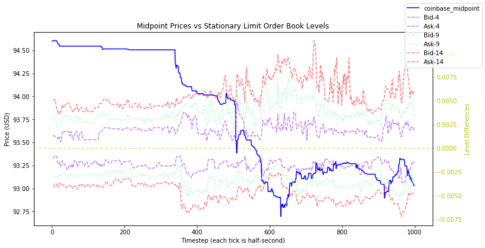
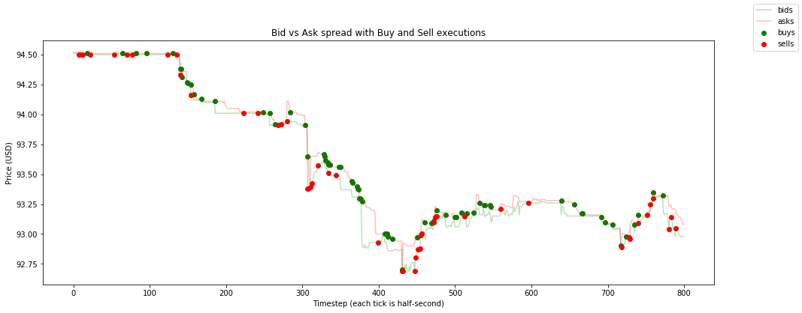

# Database
As of December 12, 2019.

## 1. Overview
The `database` module contains three files:
 - `database.py` a wrapper class for storing tick data from the `Arctic Tick Store`.
 - `simulator.py` class to replay and export recorded tick data.
 - `viz.py` class to plot exported order book snapshot data from `simulator.py`.


## 2. Classes

### 2.1 Database
This is a wrapper class used for storing streaming tick data into the
`Arctic Tick Store`.

-  The `new_tick()` method is used to persist data to Arctic and it is
   implemented in both `bifinex_connector` and `coinbase_connector`
   projects.
-  The `init_db_connection` method establishes a connection with MongoDB.
-  The `get_tick_history` method is used to query Arctic and return its
   `cursor` in the form of a `pd.DataFrame`; it is implemented in
   `database.py`.

### 2.2 Simulator
This is a utility class to replay historical data, and export order book
snapshots to a xz-compressed csv.

An example of how to export LOB snapshots to a csv is below:

```
# Find LTC-USD ticks from Bitmex Pro between April 06, 2019 and April 07, 2019.
query = {
        'ccy': ['XBTUSD'],
        'start_date': 20190406,
        'end_date': 20190407
    }
    
    
# Or, find LTC-USD ticks from Coinbase Pro AND Bitfinex exchange between April 06, 2019 and April 07, 2019.
query = {
        'ccy': ['LTC-USD', 'tLTCUSD'],
        'start_date': 20190406,
        'end_date': 20190407
    }
    
    
sim = Simulator()
sim.extract_features(query)

# Done !
```

### 2.3 Viz
This is a utility class to plot the features data exported from
`simulator.py`

Example diagrams using 500-millisecond snapshots of ETH-USD's limit
order book are below:

`plot_lob_overlay`


`plot_lob_levels`


`plot_transactions`


`plot_order_arrivals`

 

